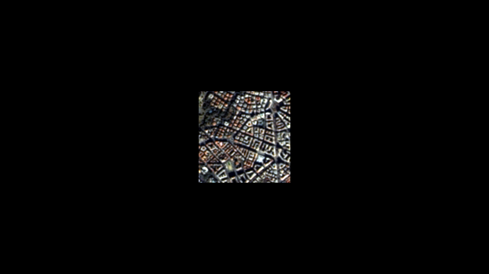
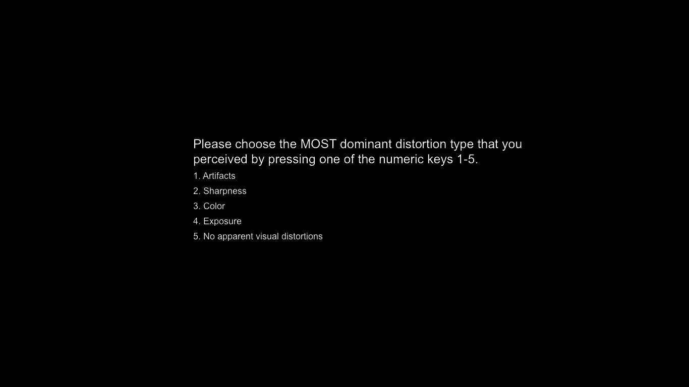

# Pansharpened-SS

This repository contains all the details and results of the subjective study of pan-sharpened images developed at Pontificia Universidad Javeriana Cali, Colombia.
## Evaluation dataset

The dataset is composed of 432 images, where half are images in true color and the other half images in pseudocolor. True color images are composed of the red (R), green (G) and blue (B) bands, that constitute the visible spectrum. The pseudocolor images are composed of near infrared (NIR), R, G bands.    

From these images, ten are pristine multi-spectral images, and 420 are fused images using six different fusion techniques, three of multi-resolution analysis and three of principal component substitution. Two distortions (blur and additive white gaussian noise (awgn)) are applied to five different scenes of the pristine Roma image from Digital Globe [1] with three intensity levels. In  total, there are:

* Five Scenes.
* Two color planes.
* Six fusion techniques.
* Two distortions that are only applied to the panchromatic image.
* Three distortion levels.

In order to prepare the subjects for the test, we generate two non-related test images (true color and pseudocolor).

## Image Distortion
Distorted images have three intensity levels as shown in the following table:

| Level   | Blur(σ) | AWGN(σ) |
| --------|---------|---------|
| 1       | 1       | 0.00250  |
| 2       | 2       | 0.01375  |
| 3       | 3       | 0.02500  |

## Image Codification
 
Each image in the dataset has a coded name that specifies the applied process. The first part of the code indicates whether the representation of the image is true color (PSN) or pseudocolor (PSP). What follows is an encoding, where each number indicates the process applied according to the position. Each number is four digits composed of the following SFDL code:
 
S: Scene 
F: Fusion Technique
D: Distortion 
L: Level 
 
The following tables are decodification maps for the image name code: 

| Code    | Fusion Technique  | Distortion|
| --------|---------|---------|
| 0       | D/A     | D/A     |
| 1       | BDSD    | Blur    |
| 2       | PCA     | AWGN    |
| 3       | IHS     | D/E     |
| 4       | GS      | D/E     |
| 5       | Wavelet | D/E     |
| 6       | HPF     | D/E     | 

D/A: Does not apply
D/E: Does not exist

For example if an image have the following codification: I_PSN_3213. This refers to an image fused with PCA generated with scene three and with a blur distortion with intensity level three. 

## Study Procedure
The session routines are developed in Matlab and the PsychToolbox [2]. The procedure follows the recommendations mentioned in [3], where the subjects indicated the quality of the video on a continuous scale between [0, 100], in which each original image is included in the experiment but not identified as such. The test will be performed with a 19" monitor to observe the images, and the screen resolution set to 1024x768 pixels, while the stimulus images will be displayed at their native resolution to prevent distortions due to scaling operations. Areas outside the images are set to mid gray. 

The study will take place during three sessions of 25 minutes each with 40 voluntaries. In each session, 142 images will be evaluated  for a total of 432 images. The sequence will start displaying a single stimulus image for 7 seconds as depicted in the following image.

Then a subject will rate the image using a continuous sliding quality bar with labels "Bad", "Poor", "Fair", "Good", or "Excellent", as shown below. 

Finally the subject select the more relevant distortion doing a keyboard selection.

In addition, we will calibrate and measure the display and room illumination and color levels during the tests using an Spyder5 PRO calibrator [4].
## References
1. Digital Globe https://www.digitalglobe.com/.
2. The psychophysics toolbox by Brainard, David H and Vision, Spatial.
3. Study of subjective and objective quality assessment of video by Kalpana Seshadrinathan, Rajiv Soundararajan, Alan Conrad Bovik and Lawrence K Cormack.
4. Spyder5 PRO Datacolor http://www.datacolor.com/photography-design/product-overview/spyder5-family/#spyder5pro.

